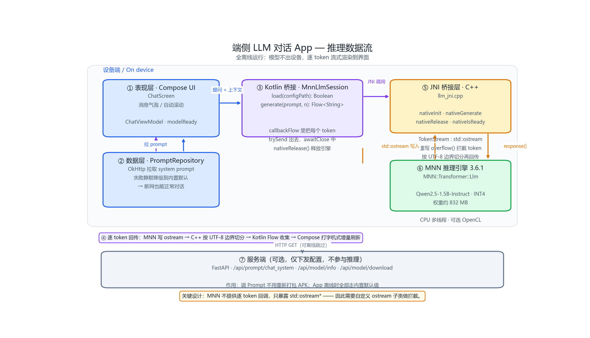

# Vibe On-Device Chat

> 基于 [MNN](https://github.com/alibaba/MNN) 的端侧大模型本地对话 Android App，**完全离线推理**，前后端同仓（monorepo）。

> **演示录屏待补**：计划录一段「飞行模式 → 提问 → 流式回答」，存为 `docs/demo.gif` 后替换本行。
> 在补上之前不放占位图，避免 README 出现坏图。

## 一句话定位

在 Android 手机上完全离线运行量化后的 Qwen2.5-1.5B-Instruct，通过 MNN 推理引擎在端侧完成 LLM 推理，支持逐 token 流式输出；服务端仅负责模型下发与 Prompt 配置。

## 为什么做这个

端侧 AI 是移动开发的下一站：隐私不出端、无网络可用、推理零成本。而它的难点不在算法，在**落地**——模型量化、内存约束、算子适配、首 token 延迟。

本项目完整走通了这条链路，其中最有价值的部分是**自己写的 JNI 桥接层**：MNN 的 C++ API 只支持 `std::ostream` 输出，不提供逐 token 回调。我实现了一个 `std::ostream` 子类，把字节流按 UTF-8 边界切分后实时回调到 Kotlin，从而在 Java 侧实现流式输出。

## 架构



数据流概览：Compose UI → `ChatViewModel` → `MnnLlmSession`(Kotlin) → JNI → `TokenStream` → MNN 引擎；
推理结果反向逐 token 回流到界面。服务端只下发 Prompt 与模型元信息，**不参与推理**。

架构图由 `tools/make_architecture.py` 生成（`python tools/make_architecture.py`），改动架构时重新跑一遍即可。

## 性能数据

<!-- 跑完后填真实数据，这一节是面试官最先看的 -->
测试设备：`<待真机实测>`

| 指标 | 数值 |
|---|---|
| 模型 | Qwen2.5-1.5B-Instruct (INT4) |
| 模型文件大小 | 868 MB（权重）/ 832 MB（全部文件） |
| 模型加载耗时 | `待实测` |
| 首 token 延迟 | `待实测` |
| 解码速度 | `待实测` |
| 峰值内存 | `待实测` |
| APK 体积 | 13.7 MB（含 libMNN.so，不含模型） |

## 快速开始

### 1. 准备模型

```bash
cd server
pip install -r requirements.txt
python download_model.py
```

模型来自 `taobao-mnn/Qwen2.5-1.5B-Instruct-MNN`（MNN 官方转换版，INT4 量化）。
HuggingFace 官方域名在国内多数网络下不可达，脚本默认走 `hf-mirror.com`。

下载后 `server/models/` 应有 4 个文件，共约 832 MB：

| 文件 | 大小 | 说明 |
|---|---|---|
| `llm_config.json` | 384 B | MNN 入口配置（**不是** `config.json`） |
| `llm.mnn` | 1.1 MB | 模型结构 |
| `llm.mnn.weight` | 868 MB | INT4 量化权重 |
| `tokenizer.txt` | 3.2 MB | 分词器 |

**注意**：hf-mirror 对 800 MB 以上的文件支持不稳定，`huggingface_hub` 可能卡在
`.incomplete` 为 0 字节。遇到时改用 curl 断点续传单独拉主权重（更稳、也更快）：

```bash
curl -L -C - -o models/llm.mnn.weight \
  https://hf-mirror.com/taobao-mnn/Qwen2.5-1.5B-Instruct-MNN/resolve/main/llm.mnn.weight
```

### 2. 编译 MNN native 库

MNN 不发布到公共 Maven，需要自己编译（详见下文「编译 MNN」）。

### 3. 构建 App

```bash
cd android
./gradlew :app:assembleDebug
adb install -r app/build/outputs/apk/debug/app-debug.apk
```

### 4. 推送模型到设备

```bash
adb push <model-dir> /sdcard/Android/data/com.example.vibeondevicechat/files/models/qwen2.5-1.5b-int4/
```

### 5. 启动服务端（可选，用于热更新 Prompt）

```bash
cd server
uvicorn main:app --host 0.0.0.0 --port 8000
```

## 编译 MNN

MNN 需要从源码编译成 arm64-v8a 的 `.so`。**不需要 bash**，用 NDK 自带的 CMake 即可：

```bash
git clone https://github.com/alibaba/MNN.git mnn-engine

cmake -G Ninja \
  -S mnn-engine -B mnn-build \
  -DCMAKE_TOOLCHAIN_FILE=$ANDROID_NDK/build/cmake/android.toolchain.cmake \
  -DANDROID_ABI=arm64-v8a \
  -DANDROID_PLATFORM=android-26 \
  -DCMAKE_BUILD_TYPE=Release \
  -DMNN_BUILD_SHARED_LIBS=ON \
  -DMNN_BUILD_LLM=ON \
  -DMNN_SUPPORT_TRANSFORMER_FUSE=ON \
  -DMNN_SEP_BUILD=OFF \
  -DMNN_BUILD_FOR_ANDROID_COMMAND=ON \
  -DMNN_OPENCL=OFF -DMNN_BUILD_OPENCV=OFF -DMNN_BUILD_DIFFUSION=OFF

cmake --build mnn-build --parallel 6

cp mnn-build/libMNN.so android/app/src/main/jniLibs/arm64-v8a/
```

两个容易踩的坑：

- **`MNN_BUILD_FOR_ANDROID_COMMAND=ON` 必须加**。否则 MNN 的一个 `POST_BUILD` 命令会报
  `Target "llm" is an OBJECT library that may not have PRE_BUILD/PRE_LINK/POST_BUILD commands`。
- **`MNN_SEP_BUILD=OFF`** 让 LLM 引擎合并进 `libMNN.so`，只产出一个库，集成更简单。

## 仓库结构

```
vibe-ondevice-chat/
├── android/                        # Kotlin + Jetpack Compose 客户端
│   └── app/src/main/
│       ├── cpp/                    # JNI 桥接层
│       │   ├── llm_jni.cpp         # ★ ostream → Kotlin 流式回调
│       │   ├── CMakeLists.txt
│       │   └── mnn/include/        # 裁剪后的 MNN 头文件
│       ├── jniLibs/arm64-v8a/      # libMNN.so（编译产物）
│       └── java/.../
│           ├── llm/                # MnnLlmSession：JNI 的 Kotlin 封装
│           ├── ui/                 # ChatScreen + ChatViewModel
│           └── data/               # PromptRepository
├── server/                         # FastAPI：模型下发 + Prompt 配置
├── prompts/                        # Prompt 模板
├── docs/                           # 架构图、性能数据
├── tools/                          # 架构图生成脚本
└── README.md
```

`docs/architecture.png` 是生成物，不要手改；改架构请改 `tools/make_architecture.py` 后重新生成。
`docs/benchmark.md` 中的性能数字需要真机实测后填写，未实测的项会明确标注为待测。

## 已配置的国内镜像

| 用途 | 位置 | 镜像 |
|---|---|---|
| Maven 依赖 | `settings.gradle.kts` | `maven.aliyun.com` |
| Gradle 发行版 | `gradle-wrapper.properties` | `mirrors.cloud.tencent.com` |

## Roadmap

- [x] MNN 端侧 INT4 模型加载与推理
- [x] 自研 JNI 桥接，实现流式输出
- [x] Compose 聊天界面
- [x] Prompt 服务端下发
- [ ] 端侧 / 云端混合推理路由
- [ ] 端侧 Function Calling
- [ ] KV Cache 跨轮次复用
- [ ] iOS 端

## License

本项目采用 [Apache-2.0](LICENSE)。

仓库内含 MNN 的公开头文件与编译产物（`libMNN.so`），来自
[alibaba/MNN](https://github.com/alibaba/MNN)，同样以 Apache-2.0 授权。
详见 [NOTICE](NOTICE)。
